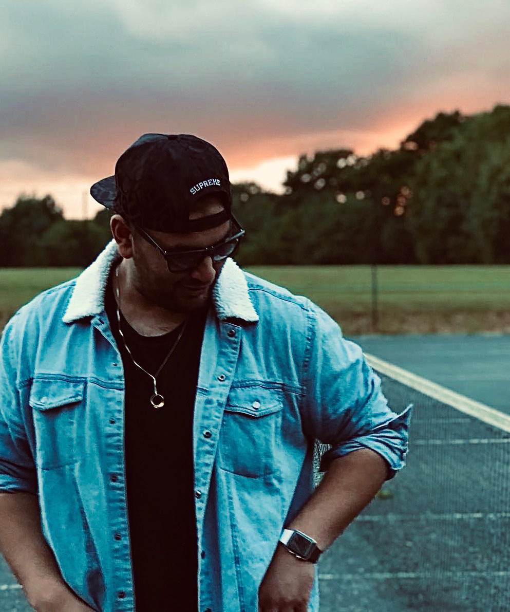

### Hi there 👋

#### My name is Awais, I am a Software Engineer that is currently studying UX Design MSc. I am passionate about Computer Science and advanced technologies. In my spare time you will probably find me reading a book 📖, playing games 🎮 or building and experimenting with software applications 💻.

###### Nationality: 🇬🇧
###### Area: Surrey

#### Follow me on Instagram and Linkedin:

### Instagram
https://www.instagram.com/interdimensional_pancake.dev/

### Linkedin
https://www.linkedin.com/feed/
<!--
**AKhatabdev/AKhatabdev** is a ✨ _special_ ✨ repository because its `README.md` (this file) appears on your GitHub profile.

Here are some ideas to get you started:

- 🔭 I’m currently working on ...
- 🌱 I’m currently learning ...
- 👯 I’m looking to collaborate on ...
- 🤔 I’m looking for help with ...
- 💬 Ask me about ...
- 📫 How to reach me: ...
- 😄 Pronouns: ...
- ⚡ Fun fact: ...
-->
